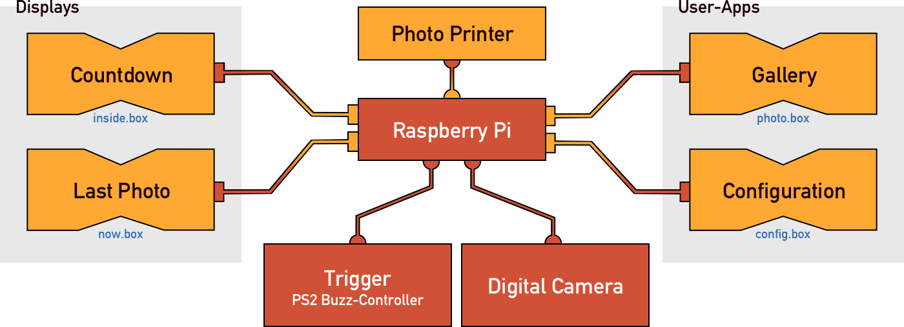
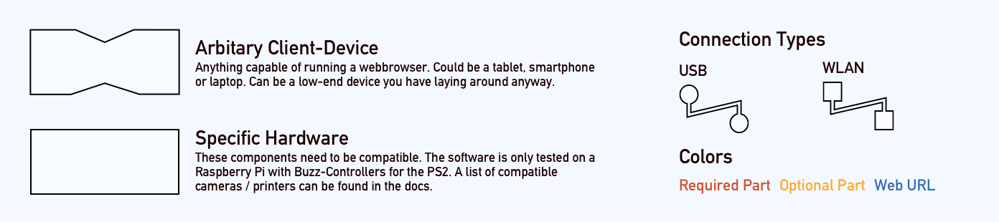

# projectBooth

projectBooth is a piece of software you can run on a Raspberry Pi to build
your own photobox. 

Because of its modularity it is possible to start simple, with just a camera
and trigger, or build more complex setups with one or multiple displays to 
show countdowns behind a magic mirror, the latest took photos, a download-gallery
for your guests and a printer.

**projectBooth is currently work in progress and not ready to use.**

## Functionality

### Components

### Legend

## Setup
TODO

## Example build
TODO

## Disclaimer
projectBooth is written as a hobby project. I developed it using rust, while learning the language. Therefore you should **not** have to high hopes/expectations on stability or security.  